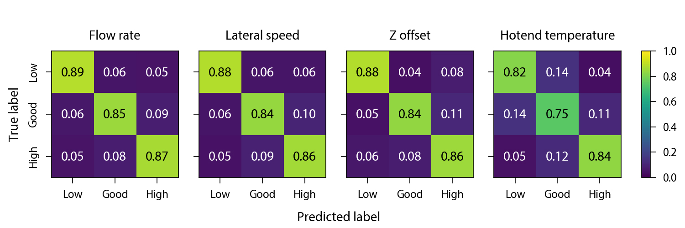

# CAXTON: The Collaborative Autonomous Extrusion Network

_Accompanying code to the publication "Generalisable 3D Printing Error Detection and Correction via Multi-Head Neural Networks"_


## Usage

This repository allows you to easily train a multi-head residual attention neural network to classify the state of the four most important printing parameters: flow rate, lateral speed, Z offset, and hotend temperature from a single input image.

First create a Python 3 virtual environment and install the requirements. We use PyTorch (v1.7.1), Torchvision (v0.8.2), and CUDA (v11.3) in this work.

```
virtualenv -p python3 env
source env/bin/activate
pip install -r requirements.txt
```

Inside the `src` directory are two sub-directories for our `data` and `model`. We use Pytorch-Lightning (v1.1.4) as a wrapper for both the dataset and datamodule classes and for our model.

Various settings can be configured inside the `src/train_config.py` file such as the number of epochs, learning rate, number of GPUs, batch size etc. Also in this file are the pixel channel means and standard deviations used to normalise the image data during training. 

To train the network use the follow line:

```
python src/train.py
```

The command line arguments `-e` for number of epochs and `-s` for the seed can be easily added to the above command.

After training the network is able to simulatneously predict the classification of the four parameters from a single input image with an average accuracy of 84.3%.



The network successfully self-learns the important features in the images during training, and attention maps aid in focusses on the latest extrusion for making predicitions. Here we show example attention masks at each module for the given input images. Each module output consists of many channels of masks, only a single sample is shown here. The masks show regions the network is focussing on, such as the most recent extrusion as shown by the output of module 2.


